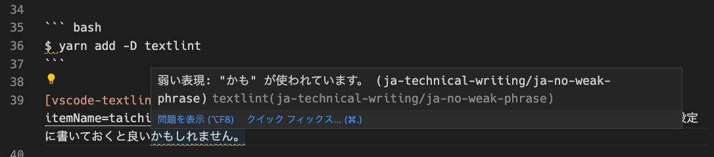

このブログはマークダウンファイルで記事を執筆&管理しているのですが、

[zenn-cli + reviewdog + textlint + GitHub Actions で執筆体験を最高にする](https://zenn.dev/serima/articles/4dac7baf0b9377b0b58b)

こちらの記事が流れてきて、[ESLint](https://eslint.org/) みたいなノリで文章校正できるのめっちゃ良さそうだなーって思ったので、このブログにも導入してみます。

※ [Zenn](https://zenn.dev/) は、Qiita のような技術知見共有サービスで、Github リポジトリで記事を管理できるのでこのブログのような SSG ベースの技術ブログと執筆体験がとても近いです。

## textlint について

公式リポジトリは [textlint/textlint: The pluggable natural language linter for text and markdown.](https://github.com/textlint/textlint) です。

> The pluggable linting tool for text and markdown.
> textlint is similar to ESLint, but it's for use with natural language.

とのことです。

CUI からも走らせられますが、[vscode-textlint - Visual Studio Marketplace](https://marketplace.visualstudio.com/items?itemName=taichi.vscode-textlint) という `VSCode` プラグインがあるのでこちらから走らせます。

## とりえあず導入してみる

`textlint` をローカルインストールします。

```bash
$ yarn add -D textlint
```

[vscode-textlint - Visual Studio Marketplace](https://marketplace.visualstudio.com/items?itemName=taichi.vscode-textlint) から、拡張機能を取得してインストールします。

僕は明示的に推奨設定に書いておきたかったので、`.vscode/extensions.json` に書いてます。

```json:title=.vscode/extensions.json
{
  "recommendations": [
    "taichi.vscode-textlint",
  ]
}
```

自明なのであえて書くこともないですけど、`textlint` がインストールされている `node_modules` のパスと設定ファイルのパスを書いておきます。

```json:title=.vscode/settings.json
{
  "textlint.nodePath": "./node_modules",
  "textlint.configPath": "./.textlintrc",
  "textlint.targetPath": "./content/"
}
```

これで、導入が終わりました。

## 日本語ルールの適用

`textlint` では、言語毎のルールを `.textlintrc` に書いていくことで適用したルールに基づいて VSCode が怒ってくれます。

ルールについては、

[Collection of textlint rule # Rules: Japanese · textlint/textlint Wiki](https://github.com/textlint/textlint/wiki/Collection-of-textlint-rule#rules-japanese)

に日本語ルールが集められています。

いちいち個別のルール選んでいくのは面倒なので、プリセットも公開されています。

[Collection of textlint rule # Rule Presets: Japanese · textlint/textlint Wiki](https://github.com/textlint/textlint/wiki/Collection-of-textlint-rule#rule-presets-japanese)

まさにって感じの [技術文書向けの textlint ルールプリセット](https://github.com/textlint-ja/textlint-rule-preset-ja-technical-writing) があったので、とりあえずこれを使って試してみます。

```bash
$ yarn add -D textlint-rule-preset-ja-technical-writing
```

```json:title=.textlintrc
{
  "rules": {
    "preset-ja-technical-writing": {
      "ja-no-mixed-period": false,  // 文末が読点以外であることを許容
      "no-exclamation-question-mark": false  // ！と？を許容
    }
  }
}
```

これで OK。



見ての通り、よろしくない表現を怒ってくれてます。

## ファイル保存時に自動修正する

修正可能なエラー自体そんな無さそうなのでウザくもないかなーってことで自動修正も適用してみます。

```json:title=.vscode/settings.json
{
  // ...
  "textlint.autoFixOnSave": true
}
```

よし、試そう！と思ったんですけど、そもそも自然言語だけあって自動修正可能な問題が見つからない。

結構試してみたけど全然当たらないんでこの頻度なら必要ないかなってことでオフりました。

とりあえずこれで終わります。
運用してみてまたなにかあったら追記します。

## 参考

- [zenn-cli + reviewdog + textlint + GitHub Actions で執筆体験を最高にする](https://zenn.dev/serima/articles/4dac7baf0b9377b0b58b)
- [textlint と VS Code で始める文章校正 - Qiita](https://qiita.com/takasp/items/22f7f72b691fda30aea2)
