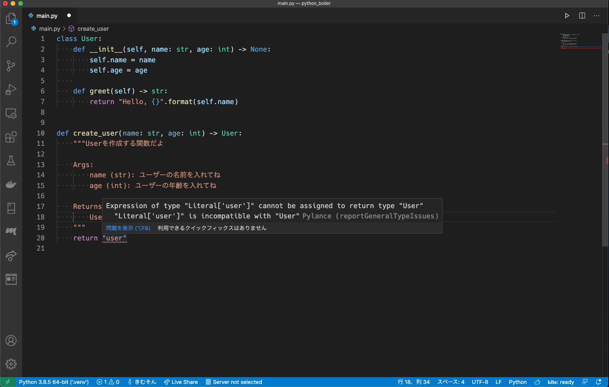
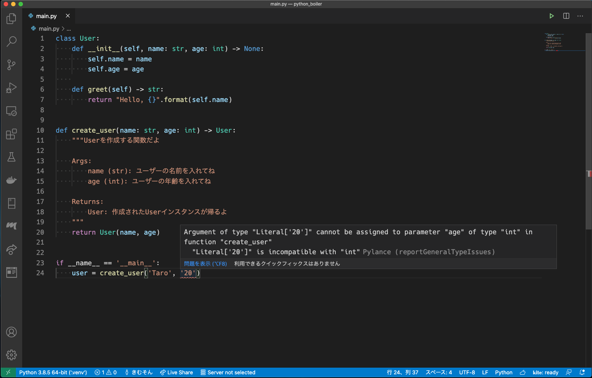
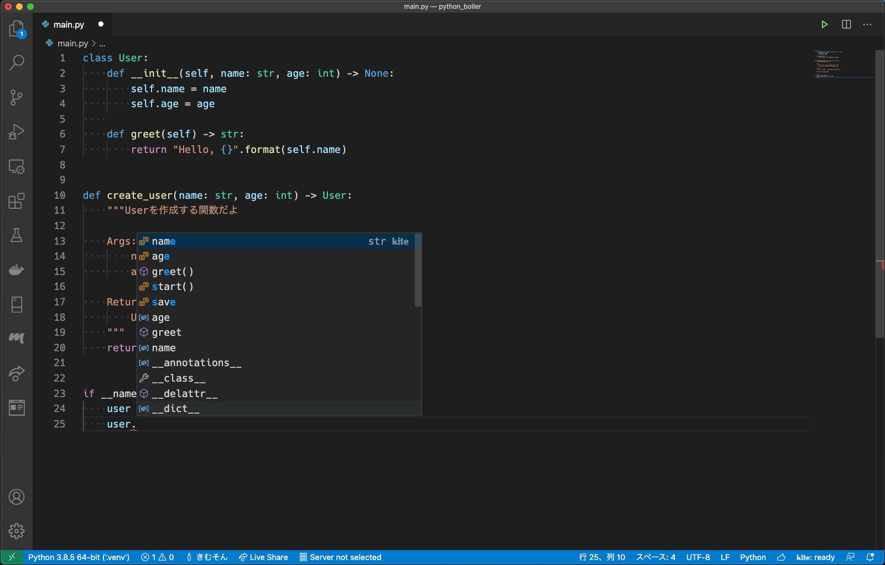
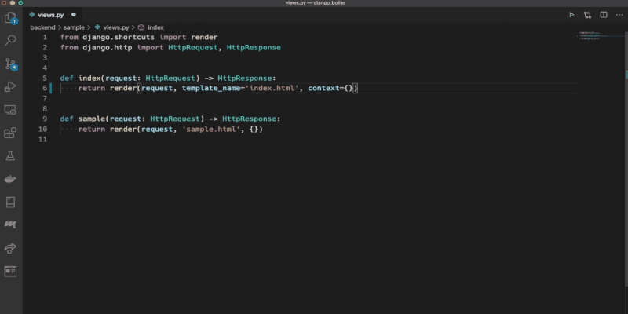

## mypyとは

[mypy](https://github.com/python/mypy) は, Python の静的型チェックツールで, Pythonにおける [型ヒント](https://docs.python.org/ja/3/library/typing.html) の機能を利用して, 型チェックをしてくれます.

``` bash
$ pip install mypy
```

で導入できます.

簡単なサンプルを見せます

``` python:title=main.py
def devide(x: int, y: int) -> float:
    return x / y


if __name__ == "__main__":
    print("{} / {} = {}".format(10, 10, devide(10, 10)))
```

こんなスクリプトを実行するときに,

``` bash
$ mypy main.py && python main.py
Success: no issues found in 1 source file
10 / 10 = 1.0
```

といった形で, 実行前に型チェックをする(コンパイル言語みたいなイメージ)ってことが可能になります.

## 型チェックのなにが嬉しいのか

型チェックは僕たちを幸せにします

### 1. 実行時例外を減らせる

実行前に型チェックを挟むことで, 実行時エラーを

1. 型チェックのエラー
2. 実行時エラー

に分割できます.

一般的に, 型の不一致で起こる例外は, 静的解析のほうが遥かにわかりやすいです.

``` python
def devide(x: int, y: int) -> float:
    return x / y


if __name__ == "__main__":
    print("{} / {} = {}".format(10, 10, devide(10, "こんにちは")))
```

例として, エラーを仕込んだこのスクリプトを静的解析ありとなしで実行してみると.

#### 静的解析なし

``` bash
$ python main.py
Traceback (most recent call last):
  File "main.py", line 9, in <module>
    print("{} / {} = {}".format(10, 10, devide(10, "こんにちは")))
  File "main.py", line 5, in devide
    return x / y
TypeError: unsupported operand type(s) for /: 'int' and 'str'
```

1. main.py で `print("{} / {} = {}".format(10, 10, devide(10, "こんにちは")))` を実行し, 
2. devide 関数の `return x / y` において TypeError が発生しましたよ
3. x(int) / y(str) は できませんよ

という内容.

例外が **呼んだ関数の中** で投げられ, 解消するには関数の中身の処理をある程度理解する必要があります.

まあ, 今回は単純な例なのでそれほど疲弊しないでしょうが, 対象の関数やメソッドが複雑になるほど追う処理が多くなって, エラー解決が難しくなります.

#### 静的解析あり

``` bash
$ mypy main.py && python main.py
main.py:9: error: Argument 2 to "devide" has incompatible type "str"; expected "int"
Found 1 error in 1 file (checked 1 source file)
```

こちらは単純ですね

devide 関数を呼ぶときに, 第2引数は int を期待してたのに, str を渡してますよ.

関数の中身を理解する必要もありません.

もちろん, 解析を挟むことで実行時例外がなくなるわけではありませんが, 引数に想定外の型を渡してるみたいな単純なエラーは静的解析で見つけてくれたほうが疲弊せずに解決できるでしょう.

### 2. 他人のコードが読みやすい

例えば、他人(あるいは過去の自分)の書いた関数を使いたいとします.

この時, 引数や戻り値の型をきちんと指定していると使い方を理解しやすくなります.

例えば, HTTP通信でよく使われる [requests](https://requests-docs-ja.readthedocs.io/en/latest/) を例に取ってみますと,

``` python
import requests

res = requests.get("https://kimuson.dev/")
```

`requests.get` は HTTPリクエストを投げてレスポンスを取得する関数ですが, 戻り値の型がはっきりしません.

dictで帰ってくるのか, 専用のクラスなのか, 後者ならどうやってデータを取れば良いのかわかりません.

``` python
print(type(res))  # <class 'requests.models.Response'>
```

`type()` で出力すればわかるけど, 毎回実行するのか?って話だし, 大きなパッケージだとソース読んでも色々な関数を跨いでたどり着くのに苦労するみたいなことは結構あります...

`requests.get` 関数が

``` python
from requests.models import Response


def get(url: str, ...) -> Response:
    ...
```

のように書かれていると, 戻り値が明確なので `requests.models.Response` を読みに行けばどうやって情報を取れば良いのかがわかります

まあこれはコメントを書いて上げれば良い話で, 実際 `requests.get` はしっかりコメントが書いてありますが.

### 3. エディタが優秀になる

型が書いてあるとエディタが関数を詳細に理解してくれるので, エディタのパワーをフル活用できます.

例えば, エラーチェック.

VSCode に mypy のプラグインを入れていると, 先程例にあげた `devide(10, "こんにちは")` の型違いエラーはCLIから `mypy` を走らせるまでもなく問題があることを把握できます


#### Pylance

最近 VSCode 拡張に [Pylance](https://github.com/microsoft/pylance-release) が追加されました

強力な言語サポートツールで、型周りのサポートも手厚いです



型と一致しない実装を教えてくれます



関数の呼び出しでの型の不一致を教えてくれます

入力補完も強力です





`mypy` と違ってプロジェクト(あるいはグローバル)にインストールする必要や設定を書く必要がないので, 手軽に型チェックの恩恵を授かれます

逆に, あくまで VSCode 拡張で, CLIツールが提供されていないので, `github actions` やら `git hooks` やらで型が守られてることを保証するみたいなことはできません

---

では, 実際に型を書いていく方法についてです

## 基本的な型の利用

型ヒントの書き方ですが, 組み込み型をメインに必要に応じて `typing` から, 必要な型を拾ってきて変数や引数, 戻り値に型ヒントを書けます

``` python
age: int = 21
```

のように型を書きますが, 変数代入については型推論をしてくれるので明示的に書く必要はありません

## コレクションとジェネリクス

`List`, `Tuple`, `Dict` 等は, 何型を格納するコレクションなのか(ジェネリクスといいます)も型に書きたいので組み込みのものより `typing` のものを使うほうが推奨されます

※ `python3.9` からは `typing` は非推奨になって組み込み型を使えるらしいです(参考: [Python 3.9の新機能 # 組み込みGeneric型 - python.jp](https://www.python.jp/pages/python3.9.html#%E7%B5%84%E3%81%BF%E8%BE%BC%E3%81%BFGeneric%E5%9E%8B))

このジェネリクスが必要な場合には, 型推論ができないので型付けをしてあげる必要があります

例えば, `list` だと

``` python
from typing import List


def devide(x: int, y: int) -> float:  # 引数と戻り値の型付け
    return x / y


if __name__ == "__main__":
    results: List[float] = []  # 変数の型付け
    results.append(devide(5, 5))
    results.append(devide(4, 5))
    ...
```

こんな感じになります

### メソッドの戻り値に自身のクラスを返す

コピーメソッドなど, メソッドの戻り値が自クラスになる場合.

``` python
class SampleClass:
    def __init___(self, x) -> None:
        self.x = x

    def copy(self) -> 'SampleClass'
        return SampleClass(self.x)
```

こんな感じで, 戻り値に自身のクラスを使うときは, シングルクォーテーションで囲む必要があります.

### Optional 型

関数には, デフォルト引数の機能があり, Noneを渡しておくみたいなことを書くことがあります

このデフォルト引数の `None` または `T型` を取るよみたいな変数を `T型` としておくのはあまり良くないです

`T型` にのみ存在するメソッドを `None` から呼んでしまうと言ったミスを型チェックで防げないからです

まあつまるところ, `None` **または** `T型` ですよみたいな型があると都合が良いってことです.

これが, `Optional[T]型` です.

``` python
from typing import List, Any, Optional


def print_array(array: Optional[List[Any]] = None) -> None:
    if isinstance(array, List):
        for item in array:
            print(item)


if __name__ == "__main__":
    print_array(None)
    print_array(["Hello", "World"])
```

`isinstance` 関数でいわゆるパターンマッチができます

引数 `array` は `Optional[List[Any]]` 型であり, `List[Any]` 型のときはこういう処理をします みたいな書き方になります

## 外部パッケージの型付け

メジャーなパッケージでは, 型定義ファイル(`*.pyi`)を提供するものも増えてきています

参考: [Stub files — Mypy 0.790 documentation](https://mypy.readthedocs.io/en/stable/stubs.html)

例えば, `Django` だと `django-stubs` として型定義が提供されています

``` bash
$ pip install django django-stubs
```

## mypy の設定

mypy の設定はオプションで渡してもいいですが, 設定ファイルにも書くこともできます.

結構自由度があるので, プロジェクトによって厳格な型チェックをいれたり, ゆるーくしたりできます.

例えば,

``` ini:title=mypy.ini
[mypy]
disallow_untyped_defs = True

[mypy-requests.*]
ignore_missing_imports = True
```

と書いてみます.

これで,

- 型を書いてない関数, メソッド定義は怒られる => 型ヒントの強制
- ただ reqeusts パッケージに関してはその限りではない

って形にできます.

詳細な設定の書き方は [ドキュメント](https://mypy.readthedocs.io/en/stable/index.html#) を見ましょう！!

## 型チェックにこだわり過ぎない

動的型言語の良さとして「とりあえず動く」を作りやすいところがあります

型が厳格であることもある大事ですが, そこまで厳格にしたいならそもそも固い言語使っとけよって話ですし, 開発効率が落ちるので, ほどよく使っていくのがよさそうです
