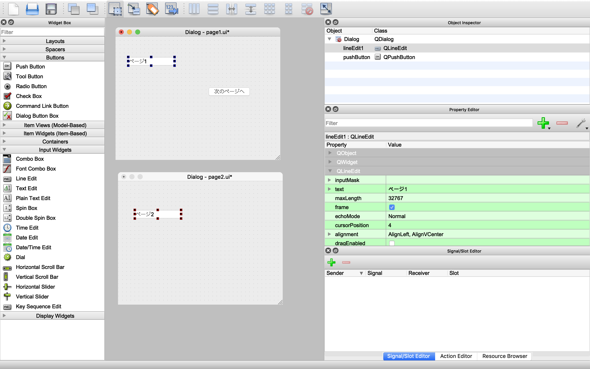

PyQtを使ってGUIアプリを作る機会がありました.

せっかくなので, PyQtを使ったPythonでのGUIアプリ開発について, 簡単に流れを紹介します.

ざっと調べた感じですが, Pythonを使ったクロスプラットフォームGUIアプリ開発の手法としては,

- [Tkinter](https://docs.python.org/ja/3/library/tkinter.html)
- [PyQt](https://pypi.org/project/PyQt5/)
- [Kivy](https://kivy.org/#home)
- [Electron](https://www.electronjs.org/) + Pythonサーバー(Flask, Django, ...etc)

辺りの選択肢があります.

ただあまりめんどうな方法で見た目を作りたくはないので, GUIの規定方法が

1. GUI操作で見た目を作れる
2. HTML + CSS等のWeb技術
3. 直接座標を用いる

の優先度でなにか良い方法ないかなって探してたんですが,

`PyQt` では `Qt Designer` なるアプリで見た目を規定できて, かなり使い勝手も良かったので簡単に開発の流れを紹介します.

ただ日本語の情報ソースが少なくて, なるべく海外の情報を参考にはしたんですが, 不適切な手法も混ざっている可能性がありますのでご了承ください.

## PyQt?

> PyQtは、クロスプラットフォームなGUIツールキットであるQtのPythonバインディングにして、PythonでGUIプログラミングをするときの選択肢の一つである -- wikipediaより

`PyQt` の強みとしては, PythonのみでクロスプラットフォームのGUIアプリを作れる点でしょうか.

Python自体デスクトップアプリケーションに適してるわけではないので, あえてPythonで作ることを検討するなら, Pythonを使う必然性があるはずです. Pythonしか書けない, コアな部分が既にPythonで実装されている等.

その場合、

- Pythonでサーバーを立てて, 別でデスクトップクライアントを作る
- (自分が使うだけなら)1のPythonサーバーをローカルで建てて動かす

等を検討したほうが良いと思います.

逆に,

- Pythonを使う必然性があり
- サーバーを建てられない / 建てたくない
- だけど, 配布はしたい

みたいなユースケースなら良い選択肢になりそうです.

## 環境構築と初期設定

PyQt5を取得します.

``` bash
$ pip install PyQT5
$ pip install pyinstaller
```

UIの作成に使う
[Qt Designer.app](https://build-system.fman.io/qt-designer-download)
をダウンロードしておきます.

### Qt Designerの初期設定

Qt Designerを開き, メニューバーからPreferenceを開きます(Cmd + ,でもOK).

- Appearanceタブの User Interface Mode を "Docked Window"に変更
- 同じくAppearanceタブの Tool Window Font でJapaneseを選択し, フォントや文字サイズを好みのものに変更.

これで準備はできたので, 実際に画面を遷移するだけの簡単なアプリを作りながら開発の流れを見ていきます.

## Qt DesignerでUIを規定



まずはGt Designerから上図のように, 画面を2つ作っていきます.

1. `New` -> `Dialog without Buttons` から画面を2つ作成し, 保存(それぞれ `page1.ui`, `page2.ui` と名付けます).
2. 画面左側の `Widget Bot` から `Line Edit` と `Push Button` を `page1.ui` に, `Line Edit` を `page2.ui` にドラッグアンドドロップします.
3. `Object Inspector`(画面右上)から, `page1.ui` の `Line Edit` を `lineEdit1`, `page2.ui` の `Line Edit` を `lineEdit2` と名前を変更します.
4. それぞれのウィジェットをダブルクリックして表示されているテキストを画像と同様に変更します.

これで画面は完成です.

## WidgetとPython関数の紐づけ

Pythonでのコーディングに移っていきます.

まずは,

``` bash
$ tree .
.
├── test.py
└── ui_files
    ├── page1.ui
    └── page2.ui
```

となるように, 実行用のtest.pyと作成した.uiファイルを設置します.
ui_filesをtest.pyと同じディレクトリに設置してしまうと, 実行ファイル化のときに不都合が起きるはずなので注意が必要です.

``` python
from PyQt5 import QtWidgets, uic

app = QtWidgets.QApplication([])  # アプリケーションを作成
ui_path = "ui_files"
dlg1 = uic.loadUi(f"{ui_path}/page1.ui")  # 作成した page1.ui を読み出して, ダイアログ1を作成
dlg2 = uic.loadUi(f"{ui_path}/page2.ui")  # 作成した page2.ui を読み出して, ダイアログ2を作成

if __name__ == "__main__":
    dlg1.show()  # ダイアログ1を表示
    app.exec()   # 実行
```

これがアプリケーションを起動するための最小構成のコードです.

.uiファイルを読み出して, ダイアログ(画面)を2つ作成して, 1つ目の画面を表示してアプリをスタートしています.

実行してみると, `page1.ui` に規定した見た目の窓が立ち上がります.

ここから処理を記述していきます.

PyQtでは基本的に, イベントが起きた時の処理を記述した関数を用意して, それを各ウィジェットのイベントに紐づけていくことになります.

まずは, page1.uiのボタンを押すと, 画面が遷移してpage2.uiの画面に遷移するように処理を書いていきます.

``` python
from PyQt5 import QtWidgets, uic

app = QtWidgets.QApplication([])
ui_path = "ui_files"
dlg1 = uic.loadUi(f"{ui_path}/page1.ui")
dlg2 = uic.loadUi(f"{ui_path}/page2.ui")


def changeView():  # dlg1 -> dlg2に遷移させる
    dlg1.hide()    # dlg1 を hide
    dlg2.show()    # dlg2 を show


dlg1.pushButton.clicked.connect(changeView)

if __name__ == "__main__":
    dlg1.show()
    app.exec()
```

新たに追加した changeView() 関数では,

page1.uiで規定されたダイアログを隠して, page2.uiで規定されたダイアログを表示させることで画面遷移を実現しています.

そして,

``` python
dlg1.pushButton.clicked.connect(changeView)
```

によって, pushButtonのクリック時の処理にchangeView()関数 を指定しています.

この `pushButton` は `Object` の名前で, `Qt Designer` の `Object Inspector` から編集できます(最初にlineEditの名前を編集したはず).

実行して, 次のページへをクリックすると画面が遷移します.

アプリ作成自体はこれで終わりです.

## Pyinstallerで実行ファイル化

Pyinstallerを使うことで, 簡単にアプリ化が行えます.

``` bash
$ pyinstaller test.py --onefile --noconsole
```

※ pyenvで導入したPythonから実行すると上手くいかないことがありますが,
[公式の対応方法](https://pyinstaller.readthedocs.io/en/v3.3.1/development/venv.html)
を参考に, 再インストールして対応できます.

これで, 以下のツリー構造にファイルが生成されるはずです.

``` bash
$ tree .
.
├── build
├── dist
│   ├── test
│   └── test.app
│       └── Contents
│           ├── Frameworks
│           ├── Info.plist
│           ├── MacOS
│           │   └── test
│           └── Resources
│               └── icon-windowed.icns
├── page1.ui
├── page2.ui
├── test.py
└── test.spec
```

dist/test.app が今回作成した .appのアプリですが, 静的ファイル(今回は page1.uiとpage2.ui)のパス関係が狂ってしまうのでうまく動作しません.

pyinstallerでは, 静的ファイルを臨時のフォルダに展開して使うらしいので, 展開されるディレクトリとパスを対応付けないといけません.

そのため, test.py 本体とさきほど生成した test.specファイルを編集します.

ちなみに, .specファイルは, アプリ化の設定ファイルです.

基本は .spec に設定を記述した上で,

``` bash
$ pyinstaller test.spec
```

で実行アプリを作っていきます(最小限の情報が記述された .specがほしかったので最初は test.pyからやりました).

静的ファイルパスとの対応付けの仕方は,

[pyinstallerの*.specファイル作成法。 -- Qiita](https://qiita.com/cheuora/items/39b3203400e1e15248ed)

が非常に参考になったので, 参考にしてソースコードとspecファイルを編集します.


### test.py

``` python
from PyQt5 import QtWidgets, uic
import sys
import os


def changeView():  # dlg1 -> dlg2に遷移させる
    dlg1.hide()  # dlg1 を hide
    dlg2.show()  # dlg2 を show


def resource_path(relative):
    if hasattr(sys, "_MEIPASS"):
        # .appから実行
        return os.path.join(sys._MEIPASS, relative)
    # 通常実行
    return os.path.join(relative)


app = QtWidgets.QApplication([])
ui_path = resource_path("ui_files")
dlg1 = uic.loadUi(f"{ui_path}/page1.ui")
dlg2 = uic.loadUi(f"{ui_path}/page2.ui")

dlg1.pushButton.clicked.connect(changeView)

if __name__ == "__main__":
    dlg1.show()
    app.exec()
```

### test.spec

``` spec
# -*- mode: python -*-

block_cipher = None


a = Analysis(['test.py'],
             pathex=['/Users/kaito/Apps/PyQt_blog'],
             binaries=[],
             datas=[],
             hiddenimports=[],
             hookspath=[],
             runtime_hooks=[],
             excludes=[],
             win_no_prefer_redirects=False,
             win_private_assemblies=False,
             cipher=block_cipher,
             noarchive=False)
pyz = PYZ(a.pure, a.zipped_data,
             cipher=block_cipher)
exe = EXE(pyz,
          Tree('ui_files',prefix='ui_files'), # 追加
          a.scripts,
          a.binaries,
          a.zipfiles,
          a.datas,
          [],
          name='test',
          debug=False,
          bootloader_ignore_signals=False,
          strip=False,
          upx=True,
          runtime_tmpdir=None,
          console=False )
app = BUNDLE(exe,
             name='test.app',
             info_plist={ 'NSHighResolutionCapable': 'True'}, #  追加
             icon=None,
             bundle_identifier=None)
```

これで対応付けができたので, 再びアプリ化を試みます.

``` bash
$ pyinstaller test.spec
```

成功して, dist/test.appから起動すると, page1.uiで規定したUIの窓が表示され, 期待通りの動作ができているはずです.

今回は開発の流れを一通りなぞることが目的だったのでこれで終わります.

## PyQt + Qt DesignerでGUIアプリ開発

`PyQt` 関係は3エントリに分けて投稿してます.

よろしければ他もどうぞ. 今回は一連の流れを追うだけだったので, 次回は主なウィジェットの使い方について紹介します.

1. [[PyQt + QtDesigner] Python で GUIアプリ開発 その1 ~ 開発の流れ ~](./)
2. **[[PyQt + QtDesigner] Python で GUIアプリ開発 その2 ~ 主なウィジェットの使い方 ~](../pyqt2)**
3. [[PyQt + QtDesigner] Python で GUIアプリ開発 その3 ~ *.connect() に引数ごと関数を渡す方法と, 汎用的画面遷移の実装 ~](../pyqt3)
