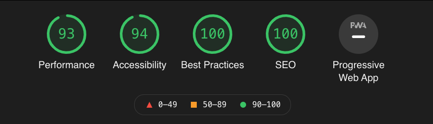

技術ブログ(このブログ)を作りました.

Qiitaとかに技術記事を投稿するのは気が引けちゃうタイプなので, 気軽に書きたいことを書いていこうかなーと思ってます.

## 使用している技術

- FW: [Gatsby.js](https://www.gatsbyjs.com/)
- 動くロゴ: [Ztext](https://bennettfeely.com/ztext/)
- デプロイ: [Netlify](https://www.netlify.com/)

その他, このブログを構築する上での知見は, [こちらのエントリ](/blog/gatsby/gatsby-blog) に記事を書きました.

## ローカルで記事をかきたかった

実は, 元々書いていた技術ブログがありました( [KLabs](https://tech-k-labs.xyz/) )

こちらもSSGの [Hugo](https://gohugo.io/) で構築されていて, ローカルの環境で自分の好きなエディタで記事を書ける感じがとても手軽で好きでした.

あとサーバー代がかからないのも👍

この辺は引き継ぎたかったので, 似たような形でかける [Gatsby.js](https://www.gatsbyjs.com/) で作りました.

## 機能にこだわった

以前のブログは,

- 記事検索ができないこと
- 目次がない (ので自分で貼ってた😭)
- ⇑ を治そうにもカスタマイズがしにくい

とかとかに不満がありました.

[Gatsby.js](https://www.gatsbyjs.com/) は, Reactがベースになっているのでカスタマイズ性が高く, 記事検索や目次の機能を実装できました！

また, Gatsbyと言えばビルドされたサイトのパフォーマスが高いことで有名だと思いますが, 実際相当高速化したので, とても満足しています😍

## これから

ひとまず完成はしましたが, 順次アップデートしていくつもりです.

以前のブログの機能面の不満をモチベーションに構築したので, 機能面は良い感じになりましたが, デザイン面が不満たらたらなので, 記事も書きつつデザインも考えつつって感じで運用していきます.
