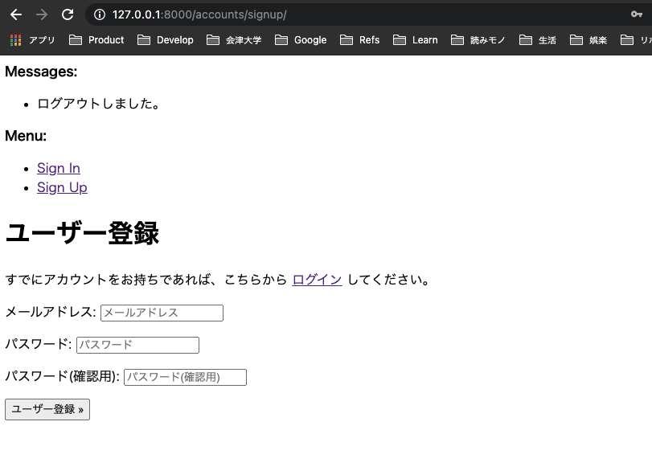
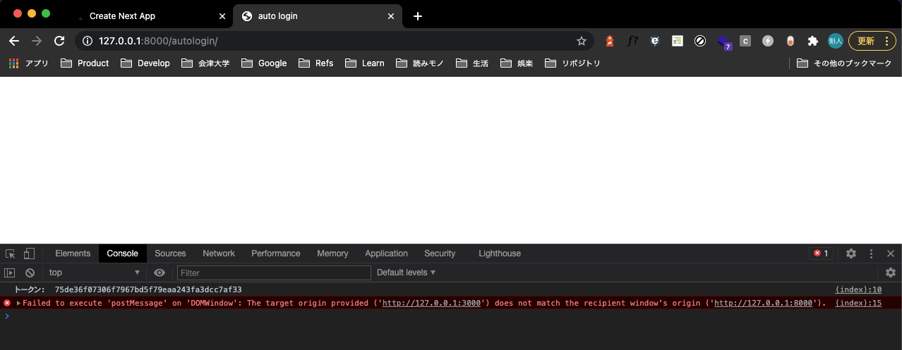
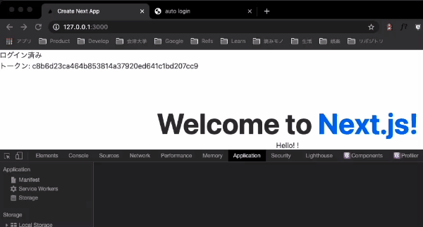

[DRF でサードパーティクッキーのセッション認証を使おうとして、諦めたけど勉強になった \| きむそん.dev](https://kimuson.dev/blog/django/drf_session_auth/)

前にこんな記事を書きました

要約すると、

SPA を作って Netlify とかにホスティングするとき、ファーストパーティーのクッキーが使えない(API サーバーとドメインが異なる)ので、認証状態の置き場は以下の選択肢しかありません

- トークンをローカルストレージに置く
- サードパーティクッキーのセッションで持つ

で、ローカルストレージは XSS の脆弱性の被害を融和しようと考えるとトークンの更新期間を短くする必要があり、UX とのトレードオフになってしまうので、セッションで持つようにしたくてサードパーティクッキーとセッションで持とうとしたけど、サードパーティクッキー自体ブロックされるようになるそうで、仕方ないからローカルストレージ使うことにしましたっていうお話でした

これ以来、自分の中では小さくても認証が絡む時点でホスティングサービス(firebase 除く)を使う選択肢はないなーって結論になっていたんですが、auth0 でローカルストレージに置かない実装がされてて感動したので真似してみようと思います

※ あくまで裏でなにが行われてるのかを試すだけなので、実装の参考にはしないでください (責任持てません)

## で、どうやって実装してるの？

[response_mode=web_message を調べた - Qiita](https://qiita.com/ksakiyama134/items/bb5a97bf7762b4a87e0d)

こちらの記事がとてもわかりやすかったです

`Web Messaging API` っていうウィンドウ間の通信が行える API(初めて知った)があって

1. iframe で認証ドメインのページを表示
2. サーバー側はファーストパーティークッキー&セッションで認証ができる
3. 「Web Messaging API でアプリ側に認証トークンを渡すスクリプト」を含んだ空 HTML を返却
4. スクリプトが読まれて、アプリ側でトークンを受け取れる

って流れで受け取れるみたいです

## てことで実装してみる

個人的な慣れの問題で Django REST framework と Next を使いますが、FW 側のコードにはあまり触れません

`django-allauth` だとテンプレートとかを一切書かずに最低限のメール認証を最小限の設定で利用できるので、とりあえずこれを使って基本的な認証を作りつつ、セッションを流用して SPA 側で新規ウィンドウでも自動でログインできる仕組みを作ってみます

API 側の認証はトークンで行うので、その辺りもセットアップしました([Django REST framework でトークン認証をする \| きむそん.dev](https://kimuson.dev/blog/django/django_token_auth/) この辺りとほぼ同じ)

細かい実装には触れないので、[リポジトリ](https://github.com/d-kimuson/drf-iframe-token-example) を読んでください

### ざっと流れ

大まかな流れはこんな感じです:

1. iframe から `src="http://127.0.0.1:8000/autologin"` (Django から配信する空ページ)へアクセスする
2. Django はセッションを見てログインチェック & OK ならユーザーに紐付いたアクセストークンを取得
3. SPA のメインウィンドウにトークンを渡すスクリプトが埋め込まれた HTML を返却する
4. スクリプトを実行して、メインウィンドウがトークンを受け取る
5. 認証できた！
6. iframe を除去して終了

トークン自体は Web Messaging API で渡します

参考: [Window.postMessage() - Web APIs \| MDN](https://developer.mozilla.org/en-US/docs/Web/API/Window/postMessage)

### Django で認証&トークンを渡すテンプレートを書く

アカウント作成・ログイン・ログアウトは `django-allauth` でデフォルトで実装済みなので飛ばします



まずは、Django 側でトークンを送るテンプレートを書いていきます

```python:views.py
from django.http import HttpRequest
from django.http.response import HttpResponse, HttpResponseBadRequest
from django.shortcuts import render
from rest_framework.authtoken.models import Token

from .models import User
from .serializers import UserSerializer


def autologin(request: HttpRequest) -> HttpResponse:
    # URL: http://127.0.0.1:8000/autologin
    if request.user.is_authenticated:
        token = str(Token.objects.get(user=request.user))
        context = {
            "token": token,
        }

        response = render(request, 'autologin.html', context)
        response["X-Frame-Options"] = "ALLOW-FROM:http://127.0.0.1:3000" # iframe 表示をSPAのオリジンからのみ許可する
        return response
    else:
        return HttpResponseBadRequest("Auth failed")
```

こんな感じでセッションベースで認証して、ユーザーに紐付いたトークンをテンプレートに渡してやります

テンプレート側では、コンテキストから受け取ったトークンを直接 JS の変数に渡して、親 Window に対してトークンを送信するスクリプトを埋め込みます

```html:autologin.html
<!DOCTYPE html>

<head>
  <title>auto login</title>
</head>

<body>
  <script type="text/javascript">
    const token = "{{ token|escapejs }}"

    function sendToken(window) {
      const mainWindow = window.parent
      mainWindow.postMessage(token, "http://127.0.0.1:3000")
    }

    sendToken(this)
  </script>
</body>

</html>
```

この時点で直接アクセスしてみると、



こんな感じで、JavaScript からトークンが取得できていることがわかります

ただ直接のアクセスなので親 Window が存在せず、特に何も起きません

### SPA 側から自動ログインする

まずは、iframe を扱うハンドラを書いていきます

```ts:utils/auth.ts
export const authOrigin = "http://127.0.0.1:8000"

export const autoLogin = (callback: (token: string) => void) => {
  // iframe を作成して、ユーザーに違和感がないよう非表示にする
  const iframe = window.document.createElement("iframe")
  iframe.style.display = "none"

  // メッセージを受信する関数
  const receiver = (event: MessageEvent<string>) => {
    if (event.origin !== authOrigin) return

    const token = event.data  // トークンが取得できる！

    // 用済みな iframe の除去
    window.document.body.removeChild(iframe)
    window.removeEventListener("message", receiver, false)

    // トークンを渡す
    callback(token)
  }

  window.addEventListener("message", receiver, false)
  window.document.body.appendChild(iframe)
  iframe.setAttribute("src", `${authOrigin}/autologin`)
}
```

これで、SPA のルートから、autoLogin を呼べば一覧のフローを経てトークンが受け取れるはずです

今回は、Next でやってるので `_app.tsx` に書いてみます

```tsx:_app.tsx
import { useState, useEffect } from "react"
import type { AppProps } from "next/app"

import { autoLogin } from "~/utils/auth"

const MyApp: React.VFC<AppProps> = ({ Component, pageProps }: AppProps) => {
  const [token, setToken] = useState<string | undefined>(undefined)

  useEffect(() => {
    if (typeof window !== "undefined") {
      autoLogin((receivedToken) => setToken(receivedToken))
    }
  }, [])

  return (
    <div>
      <div id="auth">
        <p>
          {typeof token !== "undefined"
            ? "ログイン済み"
            : "ログインしてください"}
        </p>
        <p>トークン: {token}</p>
      </div>
      <Component {...pageProps} />
    </div>
  )
}

export default MyApp
```

これでアクセスしてみます



ログインできることが確認できます！

リロードしても、iframe を経由してログイン状態を維持できていることが分かります！

## 参考

- [response_mode=web_message を調べた - Qiita](https://qiita.com/ksakiyama134/items/bb5a97bf7762b4a87e0d)
- [GitHub - auth0/auth0-spa-js: Auth0 authentication for Single Page Applications (SPA) with PKCE](https://github.com/auth0/auth0-spa-js)
