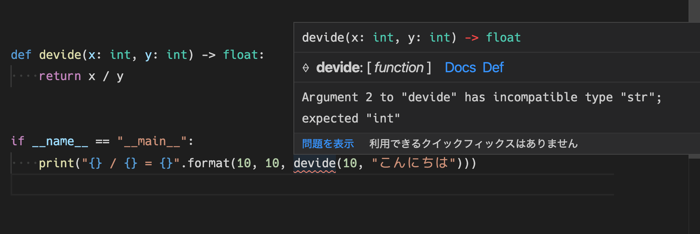
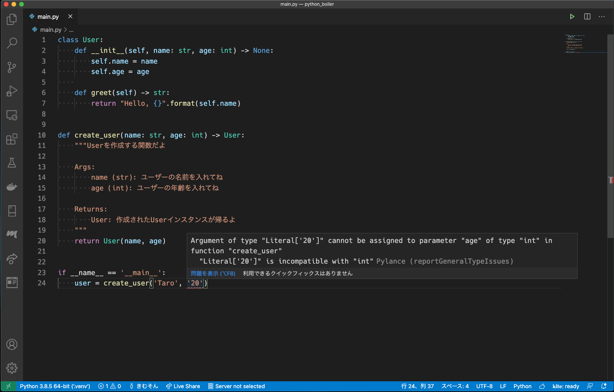

## mypy とは

[mypy](https://github.com/python/mypy) は、 Python の静的型チェックツールです

`Python` は動的型付けの言語なので、実行時に型チェックをすることができませんが、`mypy` と [型ヒント](https://docs.python.org/ja/3/library/typing.html) を利用して、型のチェックをすることができます。

```bash
$ pip install mypy
```

で導入できます。

例えば、以下のような簡単なスクリプトがあったときに、

```python:title=main.py
def devide(x: int、y: int) -> float:
    return x / y


if __name__ == "__main__":
    print("{} / {} = {}".format(10、10、devide(10、10)))
```

実行前に mypy の型チェックを行えます

```bash
$ mypy main.py && python main.py
Success: no issues found in 1 source file
10 / 10 = 1.0
```

コンパイル言語みたいなイメージです

## 型チェックのなにが嬉しいのか

型チェックを挟むことで、開発の効率を高めることができます

### 1. 実行時例外を減らせる

実行前に型チェックを挟むことで、実行時エラーを

1. 型チェックのエラー
2. 実行時エラー

に分割できます.

一般的に、型の不一致で起こる例外は、実行時のエラーより型エラーのほうが遥かにわかりやすいです

```python
def devide(x: int、y: int) -> float:
    return x / y


if __name__ == "__main__":
    print("{} / {} = {}".format(10、10、devide(10、"こんにちは")))
```

例として、エラーを仕込んだこのスクリプトを静的解析ありとなしで実行してみると、

#### 静的解析なし

```bash
$ python main.py
Traceback (most recent call last):
  File "main.py"、line 9、in <module>
    print("{} / {} = {}".format(10、10、devide(10、"こんにちは")))
  File "main.py"、line 5、in devide
    return x / y
TypeError: unsupported operand type(s) for /: 'int' and 'str'
```

1. main.py で `print("{} / {} = {}".format(10、10、devide(10、"こんにちは")))` を実行し、
2. devide 関数の `return x / y` において TypeError が発生しましたよ
3. x(int) / y(str) は できませんよ

という内容.

例外が **呼んだ関数の中** で投げられ、解消するには関数の中身の処理をある程度理解する必要があります

今回は単純な例なのでそれほど疲弊しないでしょうが、対象の関数やメソッドが複雑になるほど追う処理が多くなって、解決がしんどくなります

#### 静的解析あり

```bash
$ mypy main.py && python main.py
main.py:9: error: Argument 2 to "devide" has incompatible type "str"; expected "int"
Found 1 error in 1 file (checked 1 source file)
```

こちらは単純ですね

devide 関数を呼ぶときに、第 2 引数は int を期待してたのに、str を渡してますよ.

関数の中身を理解する必要もありません.

もちろん、解析を挟むことで実行時例外がなくなるわけではありませんが、引数に想定外の型を渡してるみたいな単純なエラーは静的解析で見つけてくれたほうが疲弊せずに解決できるでしょう.

### 2. 他人のコードが読みやすい

例えば、他人(あるいは過去の自分)の書いた関数を使いたいとします

この時、引数や戻り値の型をきちんと指定していると使い方を理解しやすくなります

例えば、HTTP 通信でよく使われる [requests](https://requests-docs-ja.readthedocs.io/en/latest/) を例に取ってみますと、

```python
import requests

res = requests.get("https://kimuson.dev/")
```

こんな感じで `GET` リクエストを送信しますが、戻り値の型がはっきりしません

ディクショナリで帰ってくるのか、専用のクラスなのか、後者ならどうやってデータを取れば良いのかわかりません

基本的には、実装を読むことになると思いますが、このときに実装に型宣言があると捗ります

`requests.get` 関数が

```python
from requests.models import Response


def get(url: str、...) -> Response:
    ...
```

のように書かれていると、戻り値が明確なので `requests.models.Response` を読みに行けばどうやって情報を取れば良いのかがわかります

### 3. エディタが優秀になる

正直上の話はおまけで、大抵のパッケージにはコメントでその辺の情報が書いてあることが多く、実際 `requests.get` はしっかりコメントが書いてあります

人が読む分にはどちらでも構いませんが、エディタが読むには型情報の方が優しいです

この辺の情報を適切にエディタが理解できることで、

- 実装を読みに行かずとも、型情報を把握できる(ホバーで表示されたりとか)
- 型情報からの入力補完が優秀
- 実行せずとも型不整合エラーを把握できる

とかとか、とにかくエディタのパワーをフルで活用できます

例えば、

VSCode に mypy のプラグインを入れていると、先程例にあげた `devide(10、"こんにちは")` の型違いエラーは CLI から `mypy` を走らせるまでもなく問題があることを把握できます



あるいは、最近 VSCode 拡張に追加された [Pylance](https://github.com/microsoft/pylance-release) が優秀で、型周りを強くサポートしてくれます

型チェックをして、問題のある実装を教えてくれたり




入力補完も、型を見てレコメンドしてくるので適切です


`mypy` と違ってプロジェクト(あるいはグローバル)にインストールする必要や設定を書く必要がないので、手軽に型チェックの恩恵を授かれます

逆に、Pylance は、あくまで VSCode 拡張で CLI ツールが提供されていないので、`github actions` やら `git hooks` やらで型が守られてることを保証するみたいなことはできません

型チェックは、mypy と競合を起こすこともあるので、私の場合は mypy を導入しているプロジェクトでは、 Pylance の型チェックは off にして、mypy と mypy 拡張にまかせる形にしてます

---

では、実際に Python で型を書いていくにあたって、最低限必要になる基礎的な型を紹介します

## 変数や引数、戻り値の型付け

まずは型ヒントの書き方ですが、組み込み型をメインに必要に応じて `typing` から、必要な型を拾ってきて変数や引数、戻り値に型ヒントを書けます

```python
age: int = 21  # 変数


# 関数
def func(arg: int) -> int:
    # ...
```

のように型を書きますが、変数代入については型推論をしてくれるので明示的に書く必要はありません

## コレクションとジェネリクス

配列(`list`, `tuple`)やディクショナリ(`dict`)と言ったコレクションは、何型を格納するコレクションなのか(ジェネリクスといいます)も型に書きたいので組み込みのものではなく `typing` の `List`, `Dict`, `Tuple` を使うことが推奨されます

※ `python3.9` からは `typing` は非推奨になって組み込み型を使えるらしいです(参考: [Python 3.9 の新機能 # 組み込み Generic 型 - python.jp](https://www.python.jp/pages/python3.9.html#%E7%B5%84%E3%81%BF%E8%BE%BC%E3%81%BFGeneric%E5%9E%8B))

空配列で変数を初期化するようなとき、ジェネリクスが型推論ができないので型付けをしてあげる必要があります

例えば、`list` だと

```python
from typing import List


if __name__ == "__main__":
    array = []              # List[?]、?が特定できないので型付けが必要
    array: List[float]= []  # OK
```

こんな感じになります

## Any 型

なんの制約もない特別な型として、[Any](https://docs.python.org/ja/3.8/library/typing.html#typing.Any) があります

基本的には、上手く型付けができないときに逃げとして使います

Python はとても柔軟なので、そもそも厳格に型付けできない実装になっていたり、継承周りで型付けがしにくくなっていたりすることがあります

```python
name: Any = 'hello'
name = 10
```

## Optional 型

Python では、`なんらかの型を格納するための変数` を用意したとしてそこに `None` が入る余地があることがよくあります

身近な例としては、デフォルト引数があります

```python
def print_log(errors: List[str]=None) -> None:
    # ...
    for error in errors:
        print(error)
```

この例だとエラーの配列を受け取る引数を準備していますが、`None` である可能性があります

デフォルト引数に限らず、特に外部(API, DB, ...etc)とのやり取りから取得した値を格納するような変数は潜在的に `None` である可能性を秘めてることが多いと思います

この辺の処理は抜けがちなので、プログラマにハンドリングを強要する意味でも明確に **None を取りうるということを型情報に付与しておく** べきでしょう

この `None` **または** `T型` を取るよっていう型が [Optional](https://docs.python.org/ja/3.8/library/typing.html#typing.Optional) 型です

ですので、引数の型付けは以下のようになります

```python
def print_log(errors: Optional[List[str]] = None) -> None:
    # ...
    for error in errors:
        print(error)
```

ただし、この実装だと errors は `List[str]` or `None` なのでループを回すときに型エラーになりますね

`isinstance` 関数を使うことで、型ガード(ブロック内で型を制限する)をして、それぞれの型で場合分けをして実装にわけて書くことが出来ます

```python
def print_log(errors: Optional[List[str]] = None):
    # ...
    if isinstance(errors, None):
        # errors: None に型付けされる
        print('No Error.')
    else:
        # errors: List[str] に型付けされる
        for error in errors:
            print(error)
```

これで型チェックも通り、安全に実行できるようになりました

## Union 型

複数の型を取りうる型として [Union](https://docs.python.org/ja/3.8/library/typing.html#typing.Union) 型があります

例えば、`Union[str, int]` なら `str` または `int` 型を取るということです

説明がしやすかったので、先に説明しましたが `Optional` は 一種の `Union` 型で、公式ドキュメントにも

> Optional[X] は Union[X, None] と同値です。

との記載があります

ですので、基本的な使い方は `Optional` と同様です

```python
from typing import Union


def func(x: Union[int, float]) -> None:
    if isinstance(x, int):
        # x: int
        # pass
    else:
        # x: float
        # pass
```

## Python ランタイムとタイプヒントの競合

Python では、依存関係の解決順の問題で型付けは OK だけど実行時エラーが起きてしまうケースがあります

わかりやすいのは、コピーメソッドで

```python
class SampleClass:
    def __init___(self、x) -> None:
        self.x = x

    def copy(self) -> SampleClass:
        return SampleClass(self.x)
```

これは、`copy` 定義時点でまだ `SampleClass` (自クラス) が未定義なのでエラーになります

この場合の対処は、型をシングルクォーテーションで囲って, Python ランタイムには文字列として評価させることです

```python
class SampleClass:
    def __init___(self、x) -> None:
        self.x = x

    def copy(self) -> 'SampleClass'
        return SampleClass(self.x)
```

他にも、同様に『型定義はあってるんだけどランタイムでエラーが起きてしまう』みたいなシチュエーションでは文字列として読ませるアプローチがよくされています

## 外部パッケージの型付け

メジャーなパッケージでは、型定義ファイル(`*.pyi`)を提供するものも増えてきています

参考: [Stub files — Mypy 0.790 documentation](https://mypy.readthedocs.io/en/stable/stubs.html)

例えば、`Django` だと `django-stubs` として型定義が提供されています

```bash
$ pip install django django-stubs
```

のように `pip install` して、適用します

### 型付けファイルが提供されていない場合

型付けファイルが提供されていない場合、mypy は型宣言の自動生成機能を持っています

外部パッケージのスタブファイルを生成するには

```bash
$ stubgen -p <パッケージ名>
```

をすることで、`out` ディレクトリ下にスタブファイルが生成されます(だいぶガバなので、ないよりはマシ程度ですが)

あとは out 下を読みに行ってくれるように

```ini:title=mypy.ini
mypy_path = out
```

`out` をパスに追加します

また、宣言部分で型エラーを吐かれてしまうので

```ini:title=mypy.ini
[mypy-<パッケージ名>.*]
ignore_errors = True
```

を設定しておきましょう

その他詳しい設定は以下の公式ドキュメントを参照してください

[Automatic stub generation (stubgen) — Mypy 0.790 ...mypy.readthedocs.io › stable › stubgen](https://mypy.readthedocs.io/en/stable/stubgen.html)

## mypy の設定

mypy の設定はオプションで渡してもいいですが、設定ファイルにも書くこともできます.

結構自由度があるので、プロジェクトによって厳格な型チェックをいれたり、ゆるーくしたりできます.

例えば,

```ini:title=mypy.ini
[mypy]
disallow_untyped_defs = True

[mypy-requests.*]
ignore_missing_imports = True
```

と書いてみます.

これで,

- 型を書いてない関数、メソッド定義は怒られる => 型ヒントの強制
- ただ reqeusts パッケージに関してはその限りではない

って形にできます.

詳細な設定の書き方は [ドキュメント](https://mypy.readthedocs.io/en/stable/index.html#) を見ましょう！!

## 最後に

ありがとうございました、この辺を抑えておけばとりあえず mypy を導入して型ありの Python を使い始めることができると思います

型チェックの良いところをたくさん書きましたが、同時に型チェックにこだわり過ぎないことも大事だと思います

動的型言語の良さとして「とりあえず動く」を作りやすいところがあります

型が厳格であることもある大事ですが、そこまで厳格にしたいならそもそも固い言語使っとけよって話ですし、開発効率が落ちるので、ほどよく妥協しながら使っていくのがよさそうです
