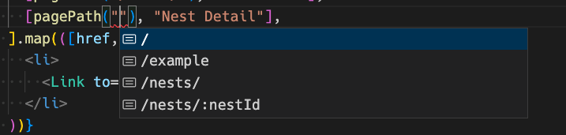
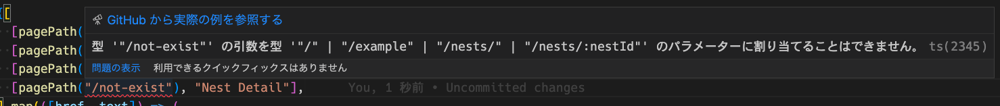

## TL;DR

最近 React Router を使う機会があり、satisfies とセットでナビゲーションを型安全にする記事を会社のアドカレで書きました

[TS 4.9 satisfies operator を使って React Router のナビゲーションを型安全にしてみる - Mobile Factory Tech Blog](https://tech.mobilefactory.jp/entry/2022/12/01/000000)

これは React Router を使うプロジェクトで良い感じの Utility 型、ヘルパー関数を定義すればナビゲーションを型安全にできるよ、というものです

ただプロジェクトにこういったユーテリティをあまり置きたくないため、ライブラリ化して公開したので紹介します

ソースコードは

[GitHub - d-kimuson/react-router-typing: Helper library to make React Router navigation type-safe](https://github.com/d-kimuson/react-router-typing)

で公開されています

npm では [ここ](https://www.npmjs.com/package/react-router-typing)

## 設定する

React Router v6.4 以上と `createBrowserRouter` の API でルーティングを宣言している必要があります (コンポーネントベースのルーティングは非対応)

```bash
$ yarn add -D react-router-typing
```

react-router の基本的なルーティング宣言に対して以下のような差分を追加します

```diff
+import { AsRouteConfig, IRoutes, asBrowserRouter } from 'react-router-typing'

const routes = [
  {
    path: "/",
    element: <HomePage />,
  },
  {
    path: "/example",
    element: <ExamplePage />,
  },
  {
    path: "/nests",
    element: (
      <NestListPage />
    ),
    children: [
      {
        path: ":nestId",
        element: (
          <NestDetailPage />
        ),
      },
    ],
  },
-]
+] as const satisfies IRoutes

-const router = createBrowserRouter(routes)
+const router = createBrowserRouter(asBrowserRouter(routes))

+export type RouteConfig = AsRouteConfig<typeof routes>
```

RouteConfig は `routes` 変数から拾った存在するパス情報を型として持ちます

RouteConfig を使ってプロジェクト用のヘルパー関数を作ります

```ts
import { generateUtils } from "react-router-typing";
import type { RouteConfig } from "./path/to/your-router-config";

export const { pagePath, pageMatch } = generateUtils<RouteConfig>();
```

これで型安全なナビゲーションを実現する pagePath, pageMatch ヘルパが追加されました

## 遷移を書くときは pagePath を使う

pagePath を使うと存在するパスのみが補完されます



存在しないパスを指定するともちろん型エラーになります



パスパラメタが必須なパスに関しても型で指定漏れを防ぐことができます


## TS 4.8 対応

このライブラリの肝は `as const satisfies IRoutes` で React Router のルーティング設定の制約をかけつつも具体的な型に解決されているところなのですが、この `satisfies` オペレータは TS 4.9 で追加されたため 4.8 以下のバージョンでは利用できません

TS 4.8 以下では `defineRoutes` 関数を使うことで同様のことができるようにしています

```ts
import { AsRouteConfig, IRoutes, asBrowserRouter, defineRoutes } from 'react-router-typing'

const routes = defineRoutes([
  {
    path: "/",
    element: <HomePage />,
  },
  {
    path: "/example",
    element: <ExamplePage />,
  },
  {
    path: "/nests",
    element: (
      <NestListPage />
    ),
    children: [
      {
        path: ":nestId",
        element: (
          <NestDetailPage />
        ),
      },
    ],
  },
-]
+])

export type RouteConfig = AsRouteConfig<typeof routes>

const router = createBrowserRouter(asBrowserRouter(routes))
```

以上です
