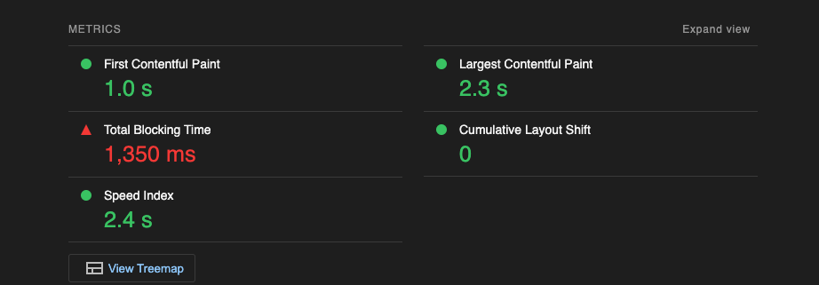
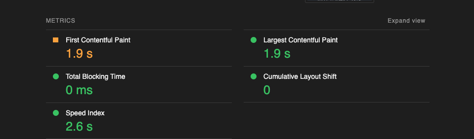

このブログの静的サイトジェネレーターを Gatsby から Astro へ乗り換えたので理由とか、結果どうだったか等を書きます。

## なぜ Gatsby をやめるのか

Gatsby にそこまで大きな不満があったわけではないんですが

- SSG のみで構成できるサイトのとき Gatsby はパフォーマンス面で最も良い選択肢だったが、後発の Astro が優位になってきており(諸説あり)、パフォーマンスを高めたかった
- Gatsby のバージョンアップ結構つらいがちでメジャーバージョン上げで結構労力持っていかれてつらかった

の2点が理由です。
ただの個人ブログなのでパフォーマンスをそこまで求めてないといえばないんですが、ちょうどGatsby v4->5へのマイグレーション時期が来ており、これをやるならキャッチアップついでに気になってた Astro を使って見ようかなと思った感じです。

## Astro はどこが良い？

Gatsby をやめた理由にも書いたんですが、Gatsby に対して Astro にパフォーマンス優位がありそうだったためです。

一般に React 等を使った SPA 系のアプローチは初回表示が遅くなるんですが、Gatsby ではビルド時にすべてのページの HTML をレンダリングしておき、実際にアクセスされたときにはレンダリング済みのHTMLを返しつつ、hydration を行います。これが過去 Gatsby がパフォーマンスが良いと言われていた所以です。

一方、hydration をしているので一応ページの内容が見える時間は短縮されるんですが、hydration の完了にはしっかりと時間がかかり、インタラクションを伴うボタン等が表示されているけど押せない、みたいな歪な状態になりやすくなります。

パフォーマンス指標的には TBT (Total Blocking Time)や INP(Interactive to Next Paint)、今はもう lighthouse からは外されていましいましたが TTI (Time To Interactive) の悪化という形で出てくると思われます。



実際に lighthouse で Gatsby で作成されたページのスコアを見てみると基本良いですが TBT 指標がわかりやすく悪いです。

Astro では Gatsby とは異なり

- 基本はクライアントサイドで JS は一切読まない
  - React / Vue ...etc のライブラリを使用できるがビルド時に実行されてテンプレートエンジンとしての利用になる
- 部分的にインタラクションが必要な場所は partial hydration する

というアプローチを取っているため、Gatsby が苦手だった TBT や TTI 指標に出るパフォーマンスが悪化しづらくなると思います。SSG しているのは変わらないのでファストビューが早いのは同じです。

※ Gatsby も v5 で partial hydration が Beta として入ったようなので Astro ほど細かなハイドレーション制御はできないと思いますが React Server Components を使った partial hydration ができそうです。

## preact-plugin を使う

Astro では独自の `.astro` というファイル形式(スタイルとスクリプトとHTMLがかけるので Vue の SFC に近いです)がサポートされていますが、任意のコンポーネントライブラリと統合できて、React やら Vue やらを好きに使うことができます。

astro ファイルは独自ファイルフォーマットをあまり使いたくないので、UI は React や Vue 等のよくあるライブラリで書いていきたいです。

先にも書いたように基本はクライアントサイドでJSは読まないんですが、インタラクションの必要なコンポーネントでは partial hydration によって読み込まれるので、できるだけサイズが小さいライブラリが望ましく preact を使うことにしました。Svelte や SolidJS はより適していると思いますが、React が書きなれてるのとそっちのキャッチアップモチベーションはあまり高くないので素直に preact を選びました。

preact は Astro 公式でサポートされています。

[@astrojs/preact 🚀 Astro ドキュメント](https://docs.astro.build/ja/guides/integrations-guide/preact/)

```bash
$ pnpm astro add preact
```

をして設問に答えると依存関係の追加だけでなく、ご丁寧に設定の記述までやってくれます！易しい！

```js:astro.config.mjs
export default defineConfig({
  // ...
  integrations: [
    preact({
      compat: true,
    }),
  ],
});
```

```json:package.json
{
  // ...
  "overrides": {
    "react": "npm:@preact/compat@latest",
    "react-dom": "npm:@preact/compat@latest"
  },
}
```

この辺の設定もしておきます。

## astro のハイドレーションを理解する

部分的にコンポーネントをハイドレーションするには、Template Directives を使います。

[Template Directives Reference 🚀 Astro ドキュメント](https://docs.astro.build/ja/reference/directives-reference/#client-directives)

> デフォルトでは、UI フレームワークのコンポーネントは、クライアントでハイドレーションされません。client:\* ディレクティブが提供されない場合、その HTML は JavaScript なしでページ上にレンダリングされます。
>
> client ディレクティブは、.astro コンポーネントに直接インポートされた UI フレームワーク コンポーネントにのみ使用することができます。水和ディレクティブは、.astro コンポーネントに直接インポートされた UI フレームワーク コンポーネントでのみ使用できます。(DeepL)

てことで、Template Directives を使ってハイドレーションのタイミングを指定できるようです。

- 指定しない (JS 自体読み込まず、hydration 自体しない)
- `client:load`
  - ページ読み込みのタイミングでハイドレーションをする
  - クライアントでも hydration されているコンポーネントは基本これ
- `client:idle`
  - [requestIdleCallback](https://developer.mozilla.org/en-US/docs/Web/API/Window/requestIdleCallback) のタイミングでハイドレーションを実行する
- `client:visible`
  - IntersectionObserver を使ってビューポートに入ったタイミングで hydration される
  - ファストビューで表示されないかつレンダリングコストが大きいときに指定すべき
- `client:media="(max-width: 50em)"`
  - 指定した条件を満たしたときのみ hydration する
  - これはレスポンシブ対応で表示されないケースが存在するときに指定すべき
- `client:only`
  - SSG でなく CSR するということ

使い分けは試してみないとわからない部分も多いですが、ドキュメントを読んだ限りで素直に考えるなら

- インタラクションがある
  - ファストビューに入らない → `client:visible`
  - メディアクエリで幅によって表示されないときがある → `client:media`
  - それ以外 → `client:load`
- インタラクションがない → 指定しない (hydration しない)
- ビルド時に確定しない情報に関する箇所(ex. ブラウザから何らかのAPIを叩いて取得等) → `client:only`

みたいな棲み分けになりそうですね。

`client:idle` に関しては優先度低い部分を後に回すことで TBT や TTI が改善するってことに見えますが、優先度が低い=ファストビューでないなら `client:visible` のが適していそうだし、ファストビューに入るなら 50ms 超えてくるとメインスレッドをブロックする処理が後ろに回されるのでむしろ TBT 悪化しそうだしでいまいち使い所がつかめないなという感想でした。

なので、基本は↑の感じで設定しつつ、パフォーマンス更に上げたいってなったら実際にハイドレーションオプションを変えて見ながら計測して適したものを選ぶのが良さそうです。

## astro コンポーネントと preact コンポーネントの棲み分け

個人的に、UI を書くという用途において間違いなく React / Vue 等のエコシステムのがしっかり発達しているし、自分が書く上でも astro テンプレートでのお行儀等の学習コストを払いたくないので基本 astro コンポーネントは書きたくないと思ってます。

astro コンポーネントでしかできないことは「partial hydrationの制御」なのでこの目的でのみ astro コンポーネントを使い、それ以外は preact のコンポーネント、という棲み分けが良さそうに思いました。

もう少し具体的にすると、atomic design で言うところの organisms くらい(サイドメニュー・ヘッダー・フッターくらいの粒度イメージ)の単位で、テンプレートディレクティブを設定したくなると思ってます。

- フッターはインタラクションあるけどファストビューから外れるので `client:visible` で良いよね
- サイドバーはスマホでは表示されないので `client:media` にしたいよね

みたいなイメージ。

なので

- template / page ラインの責務は astro コンポーネントで
- organisms 以下のコンポーネントは preact コンポーネントで

を基本的な指針にしてコンポーネントを書くようにしました。

## markdown で記事を書くには

Astro では Markdown と MDX がサポートされています。

[Markdown と MDX 🚀 Astro ドキュメント](https://docs.astro.build/ja/guides/markdown-content/)

Next.js でおなじみのファイルベースルーティングがサポートされており、pages 以下に URL 構造と揃えて記事ファイル(`*.md`) を置くこともできますが、[コンテンツコレクション](https://docs.astro.build/ja/guides/content-collections/) という別の仕組みもサポートされています。

コンテンツコレクションは `src/content` 以下にある記事ファイルを集めてから `blog/[...slug].astro` 等に持っていくアプローチで、Next.js で getStaticPaths で記事データを拾ってきて渡すのとメンタルモデルが近いです。

自分が取り掛かったタイミングではまだコンテンツコレクションの日本語Docがなくて気づかず pages でチャレンジしてたんですが、記事ファイルの frontmatter を加工する層を作るのにプラグインを自前で書かなきゃいけなかったり、記事用のデフォルトのレイアウトとかスタイルを当てるのにも独自プラグインが必要だったりしてかなり大変でした。。

僕は Gatsby (更にその前は Hugo) からの引っ越しなので frontmatter の形式は基本変えたくなく、「記事ファイルの frontmatter を加工する層が簡単に作れること」はとても大事な要件でした。pages のやり方はかなり Astro ロックインなやり方で他の SSG FW へ行くのも大変そうなので、大きな理由がなければコンテンツコレクションをオススメします。

## スタイリングをどうするか

[CSS とスタイル 🚀 Astro ドキュメント](https://docs.astro.build/ja/guides/styling/)

基本的な SCSS 等のプリプロセッサや tailwind, CSS in JS フレームワークだったりは使えそうです。

パフォーマンスを高めたいサイトなので、runtime ありの CSS in JS とそれに依存する UI フレームワークは選択肢から外されて

- tailwind (サイズが大きくなるので purge は前提)
- CSS Modules
- vanilla-extract (等の zero-runtime CSS in JS)

のどれか。

個人的に tailwind あまり好きではない(標準の方向性でがんばるべきというスタンス)んですが、最近は tailwind の勢いもかなりあって手癖をつけておきたいので tailwind を選びました。

[@astrojs/tailwind 🚀 Astro ドキュメント](https://docs.astro.build/ja/guides/integrations-guide/tailwind/)

公式ドキュメントに従って簡単に追加できました。

## その他ブログの要素を支えるオプション等

### コードブロックにタイトル表示

`extension:title` 構文でコードブロックにタイトル(ファイル名とか)を表示したい。

これは

[remark-code-titles - npm](https://www.npmjs.com/package/remark-code-titles)

このプラグインを突っ込むことで実現できました。

### 見出しの作成

コンテンツコレクションで getEntry したものを render すると headings がデフォルトで入ってきてくれます。

```ts
const entries = await getCollection("blog");
const entry = entries.at(0);

const { headings } = await entry.render();
```

実際のデータはこんな感じ。

```json
[
  { "depth": 2, "slug": "対処法", "text": "対処法" },
  { "depth": 3, "slug": "configsettingspy", "text": "config/settings.py" },
  { "depth": 3, "slug": "configurlspy", "text": "config/urls.py" },
  {
    "depth": 2,
    "slug": "swappable-オプションを使う",
    "text": "swappable オプションを使う"
  },
  {
    "depth": 2,
    "slug": "そもそも起きないようにする",
    "text": "そもそも起きないようにする"
  },
  { "depth": 2, "slug": "参考", "text": "参考" }
]
```

データはあるのであとは preact を使って好きに実装できます。

### RSS

rss も公式のサポートがあります。

[RSSフィードの追加 🚀 Astroドキュメント](https://docs.astro.build/ja/guides/rss/)

`rss.xml.ts` を用意して、一覧のページと同様にコンテンツコレクションのAPIでオブジェクトを組むだけなのでとても簡単です。

```ts
import rss from "@astrojs/rss";
import { getCollection } from "astro:content";
import { siteConfig } from "~/config/site";
import {
  buildInternalArticle,
  localOrNonDraftOnly,
} from "~/domain-object/article/internal-article";

const entries = await getCollection("internal-article");

const internalArticles = await Promise.all(
  entries
    .filter(localOrNonDraftOnly)
    .map((entry) => buildInternalArticle(entry))
).then((entries) =>
  entries.slice().sort((a, b) => (a.date.getTime() > b.date.getTime() ? -1 : 1))
);

export const get = async () =>
  rss({
    title: siteConfig.siteName,
    description: "kimuson.dev's RSS feed",
    site: siteConfig.baseUrl,
    items: internalArticles.map((article) => ({
      title: article.title,
      pubDate: article.date,
      description: article.description,
      customData: undefined,
      link: article.fullUrl,
    })),
  });
```

僕の場合はこんな感じです。

## 置き換えてみての感想

### パフォーマンスはやはり良い

置き換え後にデプロイして lighthouse のスコアを比較してみました。

|  ページ  |  対象   | Gatsby | Astro |
| :------: | :-----: | :----: | :---: |
|  トップ  | Desktop |   88   |  100  |
|  トップ  | Mobile  |   58   |  100  |
| 記事一覧 | Desktop |   82   |  96   |
| 記事一覧 | Mobile  |   52   |  92   |
| 記事詳細 | Desktop |   89   |  100  |
| 記事詳細 | Mobile  |   70   |  99   |

削った機能も一定あるので単純比較はできませんが、スコアはかなり改善しています。



冒頭の Gatsby と同条件ですが TBT 0ms なのでやはりTBTは明確に強いですね。

### 画像ファイルが mdx でないと使えない

Astro は

- public フォルダ(public/ 以下の絶対パス指定のみサポート・画像最適化がつかえない)の画像表示
- src フォルダ(相対パス指定ができる・画像の最適化が行われる)

の2つがサポートされているのですが

- 画像ファイルの入力時に補完を入れたいこと(相対パス指定でないとできない)
- せっかくなら画像の最適化してくれると嬉しい

ことが理由でこのブログでは後者を使っています。

相対パスで参照する画像ファイルは `` をみつけると import 文と img タグに内部的に変換されるっぽいんですが、mdx でないと import 文が動かないというハマリポイントがありました。

この記述はドキュメントでも見つけられず、エラーメッセージも import が unexpected token だよみたいなことしか言われないのでエスパーするしかなくて辛かったです。

### custom tsconfig が使えない

astro では tsconfig の paths のエイリアスを自動で解決してくれます。

ただ tsconfig のパスを指定するオプションがないのと Solution Style をサポートしてくれてないので

```json:tsconfig.json
{
  "files": [],
  "references": [
    { "path": "./tsconfig.src.json" },
    { "path": "./tsconfig.test.json" }
  ]
}
```

```json:tsconfig.src.json
{
  "compilerOptions": {
    "baseUrl": "./",
    "paths": {
      "~/*": ["src/*"]
    },
  }
}
```

の組み合わせを使うことができません。

テストとかで tsconfig 分けたいので自分は Solution Style を好んで使うので残念でした。

### LanguageServer が重い

`.astro` の独自コンポーネントをサポートしているので VSCode 拡張も用意してくれてるんですが、使ってみた感じあまり出来が良くない印象を受けました。おま環な部分もあるかもですが。

一応ちゃんとスクリプト部分にもテンプレート部分にも型チェックが回るんですが、`.astro` 触ってる時だけ明らかに補完やホバーでの型表示のレスポンスが遅かったり、補完が一切入らなくなったりすることががありました。restart command も用意されてないので window ごとリロードせざるを得なかったりして開発体験として悪かったです。

(Template Directive 以外は全部 preact でコンポーネントを書きたくなかったのはこれもあります。)

Volar とかはサクサク動くから原理的に厳しいってことはないと思うので今後の改善に期待です。

## まとめ

個人ブログを Astro に置き換えたので指針やつまりどころなどを紹介しました。

- 元々パフォーマンスに優れる Gatsby と比べてもパフォーマンスが高く、静的に内容が確定できるサイトならファーストチョイスになりそうで良かった
- 開発体験は拡張が重かったりして微妙だった
  - 今後に期待しつつ、astro コンポーネントは極力使わなければあまり気にならなそう
- 複数のやり方(pages/コンテンツコレクション, 画像のsrc/public 等, 任意のUIライブラリと統合できる)をサポートしがちで好みに合わせた設定がしやすいのはとても良い。一方まだ安定しきってないのもあって、特定のパターンでのみハマるみたいなポイントがつらい
- (置き換え自体スキマ時間でやってたので結構前からやってたんですが)触り始めた頃は結構微妙なところ多いなー...って印象で辛かったポイントも結構書いちゃったんですが、最近はコンテンツコレクションのサポートだったり、画像ファイルの相対パスや最適化のサポートが入ったりと使いやすくなってきてる印象

という感じでした。

最近は Zenn に書いちゃうことも多いんですが、軽い内容だったりは引き続きこっちで書いていけたらと思っているので触りつつ色々直していけたらと思います。
